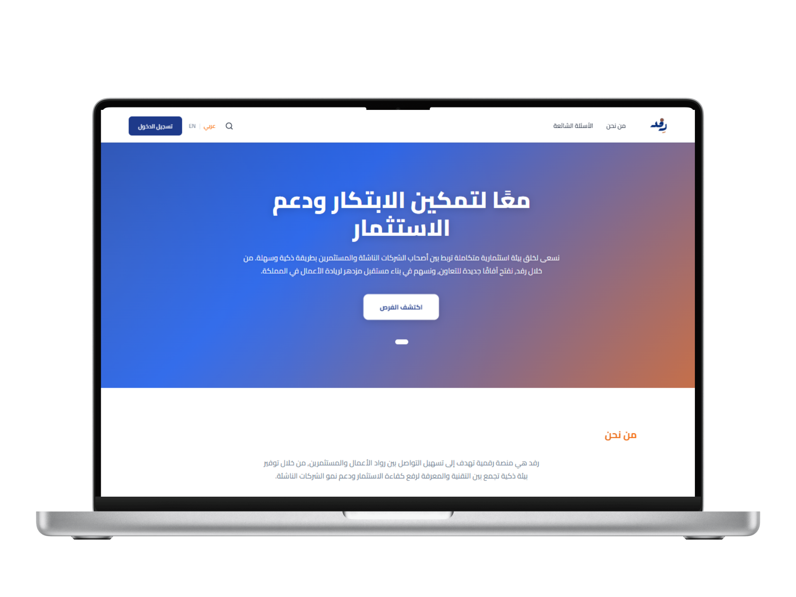
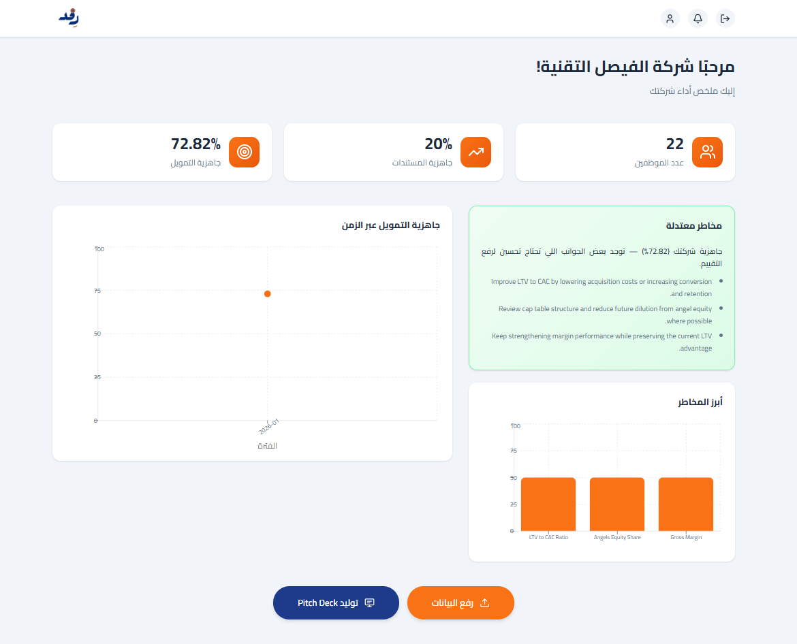
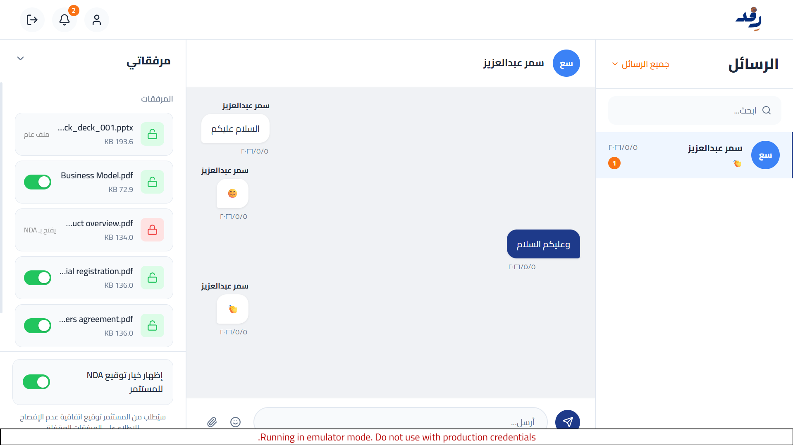
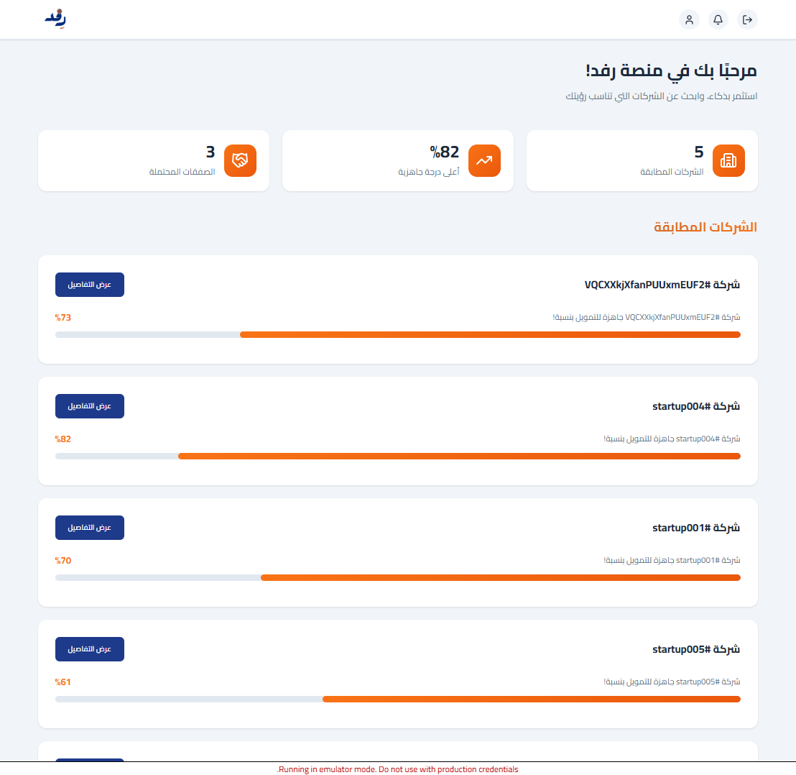
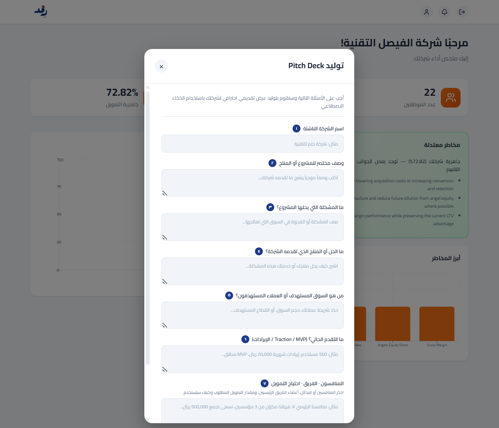

# Refd

## Overview

Refd is an AI-powered Funding Readiness Platform designed to help startups evaluate their readiness for investment opportunities through data-driven assessments and intelligent analysis.

The platform provides founders with structured insights into their business readiness while supporting investors in identifying promising ventures through a standardized evaluation process.

Developed as a graduation project, Refd combines artificial intelligence, cloud technologies, and explainable machine learning concepts to bridge the gap between startup development and investment decision-making.

---

## Project Vision

Many startups struggle to understand their investment readiness before approaching investors. Refd addresses this challenge by providing a structured assessment framework that evaluates startup preparedness and generates actionable insights.

The platform aims to support:

- Startup founders
- Investors
- Accelerators
- Incubators
- Entrepreneurship ecosystems

---

## Key Features

### Funding Readiness Assessment

Evaluate startups using structured business and operational indicators to determine their overall readiness level.

### AI-Powered Analysis

Leverages machine learning techniques to analyze startup information and support investment readiness evaluation.

### Explainable Insights

Provides transparent assessment results that help users understand the factors influencing evaluation outcomes.

### Founder Support

Helps entrepreneurs identify strengths, weaknesses, and areas requiring improvement before seeking funding.

### Investor Perspective

Offers investors a structured and data-driven view of startup readiness.

---

## Platform Screenshots

### Home Page

### Founder Dashboard

### Founder AI Assistant

### Investor Dashboard

### Pitch Deck Evaluation

---

## Project Artifacts

This repository contains project documentation and presentation materials, including:

- Project Overview
- System Architecture
- User Interface Screenshots
- Project Presentation
- Project Poster

---

## Technologies Used

### Frontend

- React
- TypeScript
- HTML
- CSS

### Backend & Database

- Firebase
- Firestore Database
- Firebase Authentication

### Artificial Intelligence

- Python
- Machine Learning
- SHAP (Explainable AI)

### Generative AI

- OpenAI API

### Development Tools

- GitHub
- Figma
---

## Repository Notice

This repository is intended for portfolio and academic demonstration purposes only.

To protect intellectual property and project assets, the following components are not publicly included:

- Source Code
- Training Datasets
- Trained Models
- Database Contents
- Deployment Configurations

---

## Team

### Riman Abdulrahman Bin Ragoosh (leader)

### Shahd Albugami

### Shahad Alshehri

Computer Science Graduate  
King Abdulaziz University

---

## Academic Information

Graduation Project

Faculty of Computing and Information Technology

King Abdulaziz University

Saudi Arabia

2026

